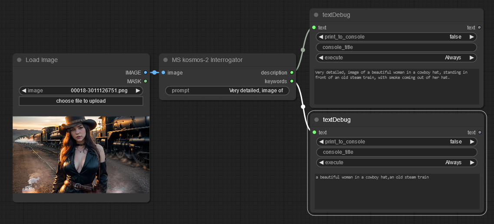
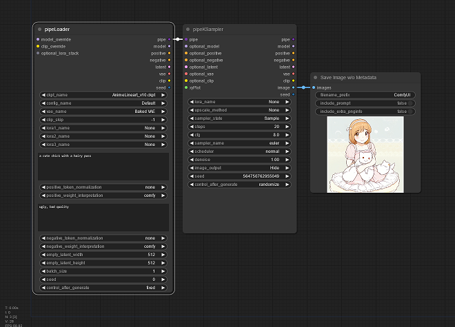
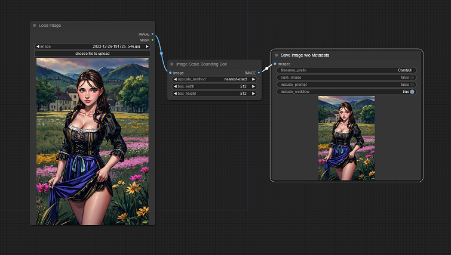

# Custom nodes for ComfyUI

[ComfyUI](https://github.com/comfyanonymous/ComfyUI) is the awesome stable diffusion GUI and backend.

**Please note that this repository is currently a (learning) work in progress and might change anytime.** It has been tested in Windows 10 only so far.

## Nodes overview:

- Kosmos-2: Grounding Multimodal Large Language Models to the World
- Save Image with or without Metadata
- Scale an Image To A Bounding Box

## Updates

* Save Image now has only 1 button to include/exclude metadata. You now can disable saving the image, thus it acts as an image preview only. Note that you can still save the image, by right clicking on it, that will include or exclude the workflow according to the setting.
* kosmos-2 interrogator now outputs a mask indicating the recognized elements in the image.

### Node: Microsoft kosmos-2 for ComfyUI

An implementation of [Microsoft kosmos-2](https://huggingface.co/microsoft/kosmos-2-patch14-224) text & image to text transformer .

This node takes a prompt that can influence the output, for example, if you put "Very detailed, an image of", it outputs more details than just "An image of". kosmos-2 is quite impressive, it recognizes famous people and written text in the image: \

_**kosmos-2 output:** An image of Donald Trump giving the peace sign with the words "Make America Great Again" written next to him._

**At the first start, the kosmos-2 model files will be downloaded from huggingface. Please be patient.** The model file is about 6GB in size. There is a cpu/gpu selector, but be aware that the model will eat up about 6GB of your precious VRAM in gpu mode!

[See example outputs and workflows](examples/examples.md)

---

### Node: Save Image w/o Metadata

 \
With this custom save image node, you can include or exclude the ComfyUI workflow metadata in the saved image. It is a derivation of ComfyUI's built-in save image node.

---

### Node: Scale Image To Bounding Box

This node scales an input image into a given box size, whereby the aspect ratio keeps retained.

---

## Installation

Unzip or git clone this repository into ComfyUI/custom_nodes folder and restart ComfyUI.
