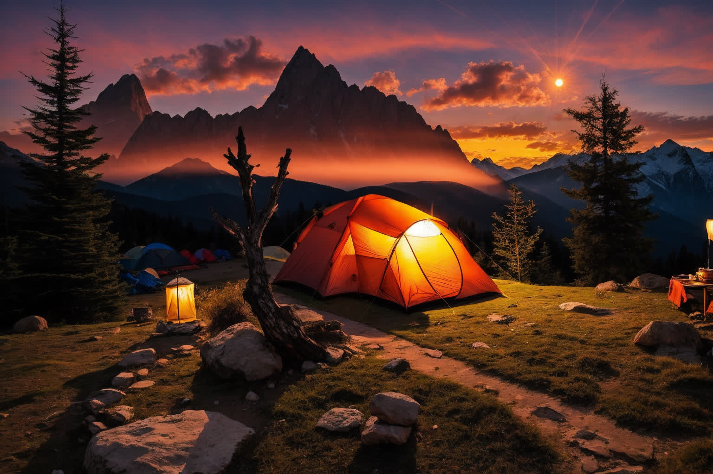
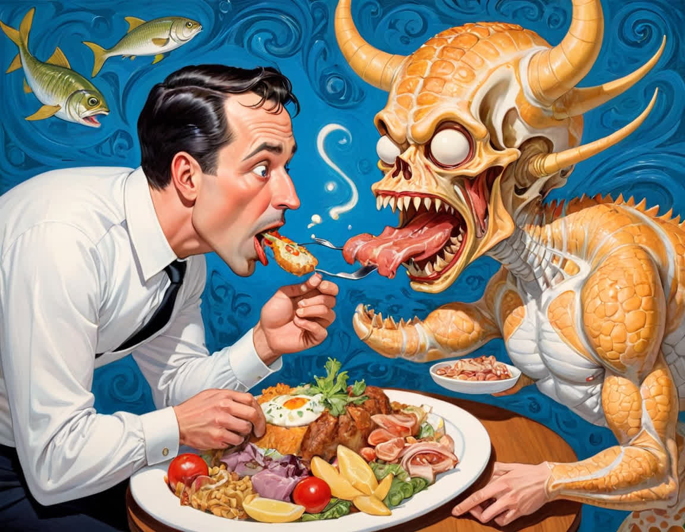
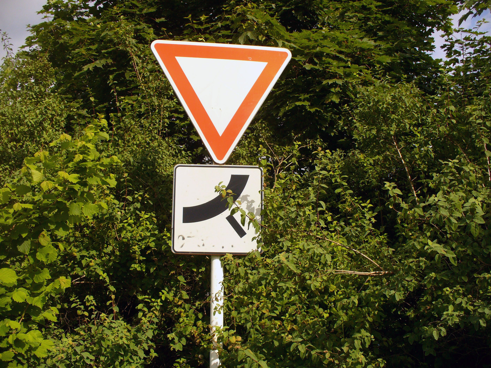
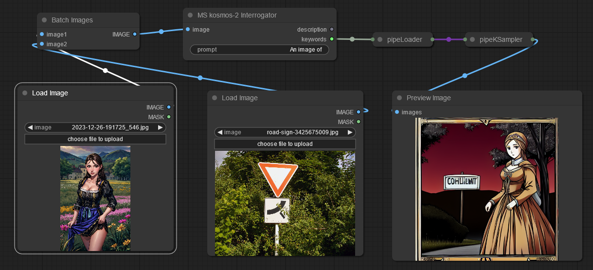
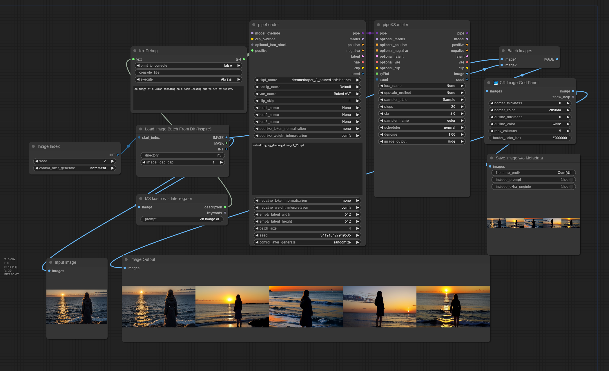
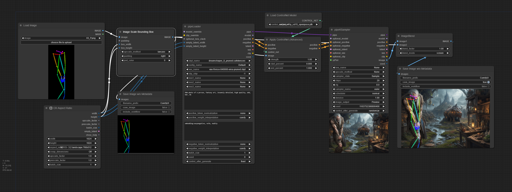

## kosmos-2 examples:
(Non cherry picked)

<table>
    <tr>
        <td></td>
        <td>
            <b>Prompt:</b> An image of 
            <b>Output</b> 
            Description: An image of a tent and lantern under a beautiful sunset. 
            Keywords: a tent,lantern,a beautiful sunset

        </td>
    </tr>
    <tr>
        <td></td>
        <td>
            <b>Prompt:</b> An image of 
            <b>Output</b> 
            Description: An image of a man eating a plate of food with a monster eating it out of his mouth. 
            Keywords: a man,a plate of food,a monster,his mouth

            <b>Prompt:</b> A very detailed description of 
            <b>Output</b> 
            Description: A very detailed description of the food in the plate, the man is eating a large piece of meat, while the monster is devouring the food. 
            Keywords: the plate,the man,a large piece of meat,the monster,the food

        </td>
    </tr>
    <tr>
        <td></td>
        <td>
            <b>Prompt:</b> An image of 
            <b>Output</b> 
            Description: An image of a beautiful woman in a medieval dress. 
            Keywords: a beautiful woman in a medieval dress

            <b>Prompt:</b> A woman doing 
            <b>Output</b> 
            Description: A woman doing a striptease in a field of flowers. 
            Keywords: a field of flowers

            <b>Prompt:</b> The background of this image 
            <b>Output</b> 
            Description: The background of this image is a beautiful countryside scene with a woman standing in a field wearing a black and blue dress. 
            Keywords: a woman,a field,a black and blue dress
        </td>
    </tr>
    <tr>
        <td></td>
        <td>
            <b>Prompt:</b> This image shows 
            <b>Output</b> 
            Description: This image shows a road sign and a traffic sign in the woods. 
            Keywords: a road sign

        </td>
    </tr>
    <tr>
        <td></td>
        <td>
            <b>Prompt:</b> (none) 
            <b>Output</b> 
            Description: The flyer for the opening of the semester. 
            Keywords: The flyer for the opening of the semester

        </td>
    </tr>
</table>

---

 \
_**Example workflow:** generate a combination of two images_

---

---

 \
_**Batch process images from a directory:** Set the Image Index node to 0 and auto increment, and activate "Auto Queue". ComfyUI will stop with an error when finished._

---

## Image scale bounding box examples

 \
_Automatic fit an openpose image to the output image size_

---